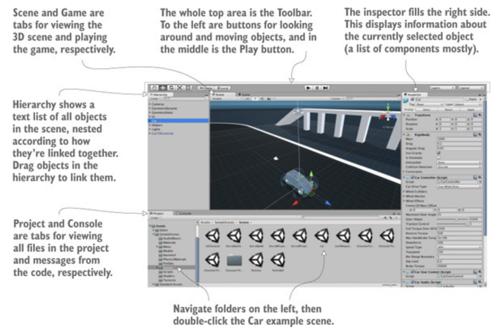
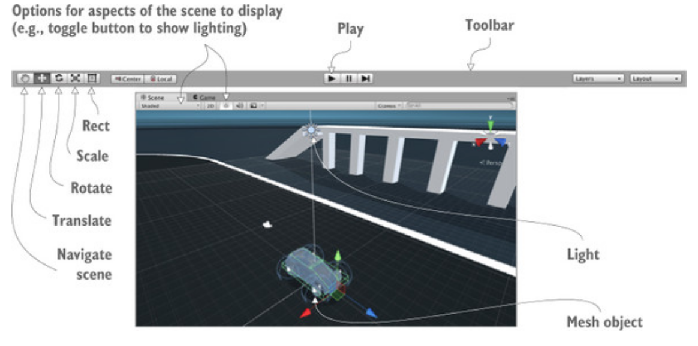
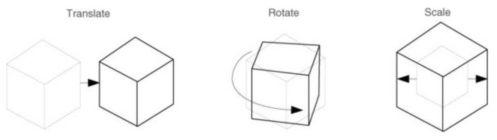
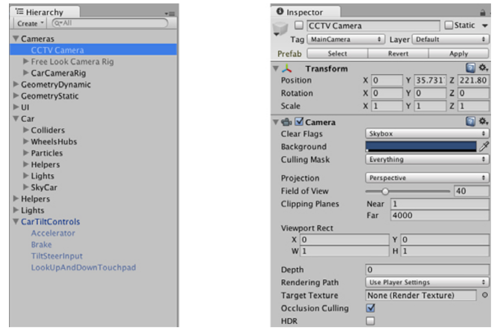
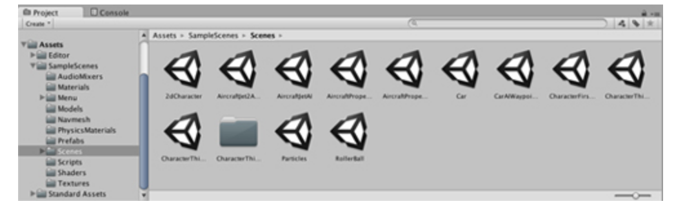

# Introduction

## Why Unity is so great
Well, because it has been using to make many games. Check the link below out:
https://unity.com/madewith
### Interface
* 
### Scene view, game view and the toolbar
* 
`Scene view` is where you can see what the game world looks like and move objects around. There are : Camera, Lights, Audio sources, collision regions, mesh objects and so forth. 
`Mesh object : is a visual object in 3D shape. Visuals in 3D are constructed out of lots of connected lined and shapes. => it is called mesh

`Game View` when the game is running, you can see the game in this view. It automatically switches to game view when the game starts.
To run the game, simply hit the `Play` button.

`Toolbars`: Buttons used for scene navigation and transforming objects - how to look around the scene and moving objects. The layout and layer drop-down in the right hand side allow you to switch between layouts

### Using the Mouse and Keyboard
There main navigation manueuvers are : Move, Orbit and Zoom( Translate, Rotate and Scale)
* 
Besides the buttons in the toolbars to do these manueuvers, you can press W, E, R.
https://docs.unity3d.com/Manual/SceneViewNavigation.html
https://docs.unity3d.com/Manual/UnityHotkeys.html
When you active a transform, you’ll notice a set of color-coded arrows or circle appears over the object in the scene; this is the Transform gizmo, you can click-drag this gizmo to apply the transfornation

The last button of toolbars is Rect tool. It is designed for use with 2D graphics. It combines movement, rotation and scaling. 

### Hierachy taband the Inspector
* 
`Hierachy` is a list view with the name of every object in the scene listed, with the names nested together according to their hierachy linkages in the scene.

The `inspector` shows you information about the currently slected objects.

### The project and Console tabs
* 
Project shows all assets in the project. 
The console is the place the messages from the code show up

## Running with Unity programming 

All code excecution in Unity starts from code files linked to an object in the scene. Game objects are built up as a collection of components, and that collection can include `scripts` to execute.

`MonoBehaviour` is the base class for scripts components. It defines the invisible groundwork for how components attach to game objects, and inheriting from it provides a couple of automatically run methods that you can override. Basically it gives you predifined methods.
`Start()` is called once when the object becomes active (Which is generally as soon as the level with that object has loaded)
`Update()` is called very frame.

A `frame` is a single cycle of the looping game code. Nearly all video games (not just Unity, but video games in general) are built around a core game loop, where the code executes in a cycle while the game is running. Each cycle includes drawing the screen, hence the name frame (just like the series of still frames of a movie)

Saving the scene will create `.unity` with the Unity icon. The scene file is the snapshot of everything currently loaded in the game so that you can reload this scene later. 

 
