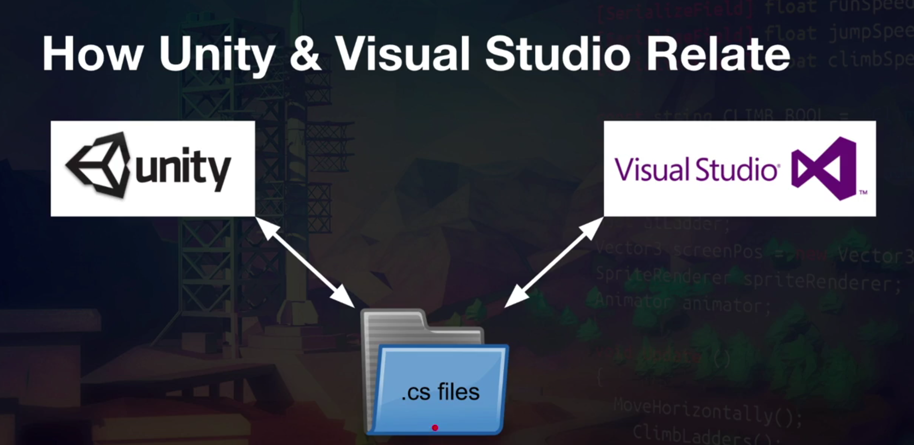
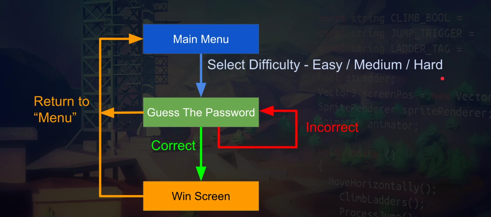
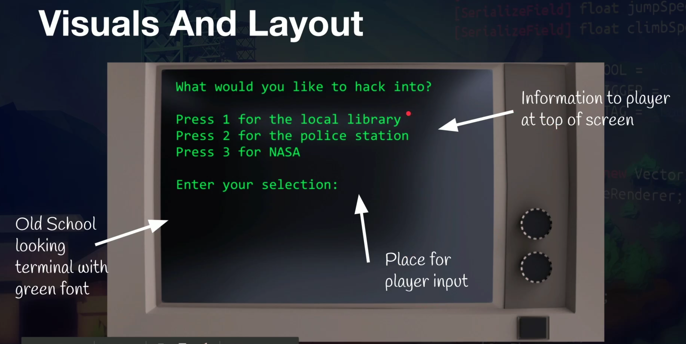
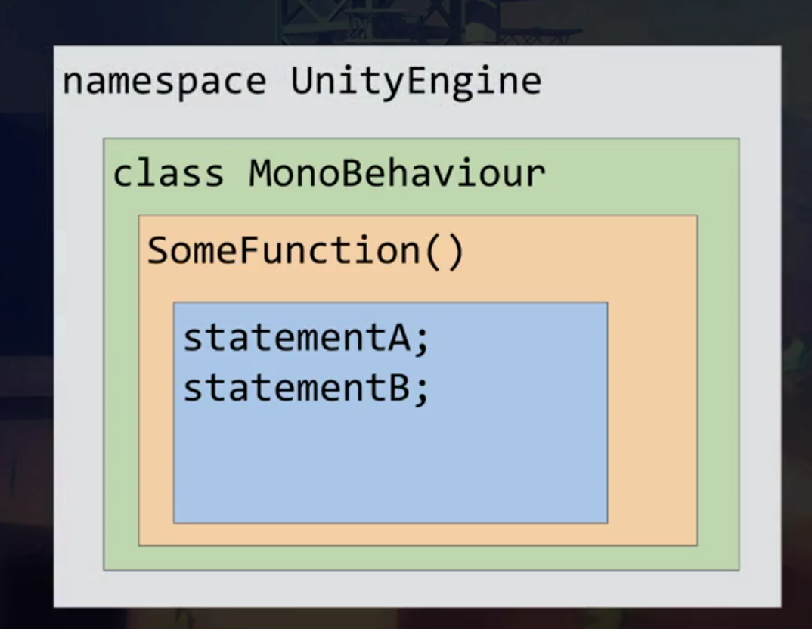

# Create Hacking game (Basic C#)

* Before jumping into coding (prerequisite)
    * To set up editor
        * In Mac: Unity-> Preferences-> External tools-> External Script Editor -> Pick one you like.
    * To import asset
        * Right click at asset panel -> import package -> custom package (WM2000 asset pack v.1)
    * Create a scene and drag asset to the created scene
{style="display: block; margin: 0 auto" }
## 1. Game design
{style="display: block; margin: 0 auto" }
## 2. How does it look
{style="display: block; margin: 0 auto" }
It is basically an anagram guessing game. 
Words samples:
*  Easy (library) : Books, aisle, shelf, password, front, borrow
*  Medium (Police): Prisoner, handcuffs, holster, uniform, arrest
*  Hard (Nasa): starfield, telescope, environment, exploration, astronauts.

## 3. Writes a line of text to the terminal screen
* Create Hack.cs and attach it to WM2000 object
```c#
    void Start()
    {
        print("Hello console!”);// Print to console
        Terminal.WriteLine("Hello World");
    }
```
## 4. Organising in Unity C#

{style="display: block; margin: 0 auto" }

* Variable 
https://docs.microsoft.com/en-us/previous-versions/visualstudio/visual-studio-2008/wew5ytx4(v=vs.90)
* Passing parameters
https://docs.microsoft.com/en-us/dotnet/csharp/programming-guide/classes-and-structs/passing-parameters
* C# operator
https://docs.microsoft.com/en-us/dotnet/csharp/language-reference/operators/
* Expression
https://docs.microsoft.com/en-us/dotnet/csharp/programming-guide/statements-expressions-operators/expressions
* If/else
https://docs.microsoft.com/en-us/dotnet/csharp/language-reference/keywords/if-else
* Enum 
https://docs.microsoft.com/en-us/dotnet/csharp/language-reference/keywords/enum